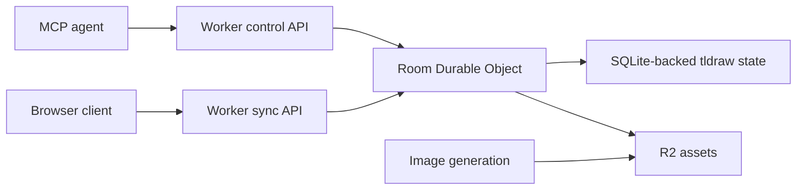

# Graze Architecture Remediation Plan

This plan turns the Droid-era prototype into a system that can be understood,
deployed, and trusted. The short version: Graze currently has a real tldraw
sync layer and a separate agent control layer. The highest-leverage work is to
make the Durable Object-backed tldraw document the only authoritative canvas
state, then move agent writes and reads onto that same authority.

## 2026-05-05 Implementation Note

Codex implemented the first major migration slice:

- Agent shape writes now flow from MCP/Bun to Worker room-control routes and are
  applied inside `TLSyncDurableObject` via `TLSocketRoom.updateStore`.
- `reply`, human message notes, `create_shape`, `update_shape`,
  `delete_shapes`, browser-triggered image generation, and agent-generated image
  shape creation no longer depend on open browser tabs for persistence.
- MCP now exposes `read_shapes` for authoritative structured state.
- `read_canvas` is documented and returned as a browser-posted visual snapshot,
  not authoritative state.
- Production client and Bun sidecar configuration now fail more explicitly.
- Worker preview URLs are disabled, and mutating/quota-bearing/network-fetching
  Worker routes require `GRAZE_ACCESS_TOKEN` outside local dev.
- Image generation now enforces input count, input MIME, input size, and output
  size limits.
- The React side-channel WebSocket cleanup no longer schedules reconnects after
  unmount.

Remaining larger work:

- Put browser sync itself behind Cloudflare Access or another real deployment
  boundary before public use.
- Consider moving remote MCP/control fully into the Worker if Graze becomes more
  than a local MCP bridge.
- Refactor `src/App.tsx` now that the worst source-of-truth problem is reduced.

## Current State

- Build, lint, and tests pass after the Codex cleanup pass.
- The Factory Droid mission is complete, but the repo still feels mid-flight:
  the image-generation and MCP paths work like a local prototype rather than a
  production deployment.
- Real multiplayer canvas state lives in the Cloudflare Worker Durable Object.
- Agent control currently flows through a Bun side-channel server and browser
  WebSocket commands.
- Some agent commands rely on an open browser to mutate the synced tldraw store.
- Production URL defaults still assume local development unless environment
  variables are set correctly.
- Worker endpoints are unauthenticated and include quota-bearing image
  generation, uploads, unfurling, and canvas sync.
- `read_canvas` returns the last manually posted PNG snapshot, not guaranteed
  current document state.

## North Star

Graze should have one source of truth:

In that target architecture:

- Browsers render and interact with the canvas.
- The Durable Object owns the current canvas state.
- Agent commands write to the authoritative canvas state directly.
- Agent reads come from the authoritative state, or are explicitly labeled as
  visual snapshots when they depend on browser rasterization.
- Image generation is bounded, authenticated, and observable.
- Local development remains easy, but production fails loudly when required
  configuration or access control is missing.

## Phase 0: Preserve the Known Good Baseline

Goal: make the current working point easy to recover.

- Commit the build/lint/test cleanup separately from architecture changes.
- Record the Droid mission ID, commit range, and Codex handoff in project notes.
- Add this plan to the repo as the active migration guide.
- Update the README with a blunt "prototype architecture" section so future
  work starts from the real state, not the aspirational one.

Acceptance criteria:

- `npm run build` passes.
- `npm run lint` passes.
- `bun test --bail=1` passes.
- The repo has a visible plan and a short current-state note.

## Phase 1: Put Hard Edges Around Deployment

Goal: stop accidental public or half-configured deployments.

- Replace production `localhost` defaults with explicit configuration checks.
- Keep dev defaults only behind a clear development-mode branch.
- Require `VITE_API_URL` when the client is built for non-local deployment, or
  make the client use same-origin Worker routes if that becomes the chosen
  architecture.
- Require `GRAZE_WORKER_URL` for non-dev Bun execution while the Bun sidecar
  still exists.
- Decide the access boundary before preview/public use:
  - Cloudflare Access in front of the Worker, or
  - a simple shared bearer token for all mutating and expensive endpoints, or
  - private-network-only deployment with preview URLs disabled.
- Disable `preview_urls` unless previews are also protected.

Acceptance criteria:

- A production build cannot silently point at a viewer's own `localhost`.
- Expensive or mutating Worker routes have an access gate.
- README explains local and production environment variables separately.

## Phase 2: Make Agent Writes Authoritative

Goal: remove the browser-as-mutation-worker pattern.

- Introduce a Worker-side control route for agent canvas mutations.
- Route MCP `create_shape`, `update_shape`, and `delete_shape` through that
  Worker route instead of broadcasting shape commands to every browser.
- Move shape ID generation to the server/control path when the caller does not
  provide an ID.
- Apply shape changes inside the same room Durable Object that serves tldraw
  sync.
- Keep browser WebSocket broadcasts only for local UI affordances that are not
  authoritative state changes.
- Add tests for:
  - no browser connected,
  - one browser connected,
  - two browsers connected,
  - caller-provided shape ID,
  - server-generated shape ID.

Acceptance criteria:

- An agent-created shape persists with zero browsers open.
- Multiple open browsers do not create duplicate shapes.
- MCP success means the authoritative store accepted the mutation.

Open design question:

- We need to inspect the tldraw sync storage API carefully before implementation.
  The right fix may be direct store mutation in the Durable Object, or a small
  server-side adapter that speaks the same change format the sync room expects.

## Phase 3: Make Agent Reads Honest

Goal: stop pretending the last PNG snapshot is the current canvas state.

- Rename the current `read_canvas` behavior to something explicit like
  `read_last_snapshot` if it remains browser-rasterized.
- Add an authoritative read path for structured canvas state from the Durable
  Object.
- Decide whether agents need:
  - structured shape JSON,
  - a visual PNG snapshot,
  - or both.
- If visual snapshots are still needed, make them an explicit asynchronous job
  that can report "no browser available" instead of returning stale memory.

Acceptance criteria:

- Agents can read current shape state after a server-side mutation.
- Snapshot freshness is visible to callers.
- Bun process restarts do not erase the only agent-readable canvas state.

## Phase 4: Bound Image Generation Cost and Memory

Goal: make `/api/images/generate` safe enough to expose behind the chosen access
gate.

- Limit multipart request size, number of input images, and accepted MIME types.
- Reject oversized Replicate/OpenAI output before writing to R2.
- Avoid unbounded buffering where possible; stream uploads/downloads when the
  platform and upstream API allow it.
- Add per-request structured logs for model, input count, output size, duration,
  and failure reason.
- Consider moving long-running generation into an async job model if requests
  approach Worker runtime or memory limits.
- Add tests for oversized files, too many files, bad MIME types, upstream
  failure, and missing auth.

Acceptance criteria:

- Large or invalid image requests fail early.
- The route cannot casually spike Worker memory with unbounded input/output.
- Quota-bearing calls are authenticated and observable.

## Phase 5: Shrink the Browser App's Responsibility

Goal: make `src/App.tsx` a canvas UI, not the control plane.

- Fix the WebSocket cleanup/reconnect bug.
- Split side-channel protocol handling into a dedicated hook or module.
- Split image prompt UI/orchestration from canvas command handling.
- Move protocol validation helpers out of `App.tsx`.
- Keep only browser-native responsibilities in React:
  - rendering the tldraw editor,
  - user interactions,
  - local UI state,
  - optional rasterization when requested.

Acceptance criteria:

- Unmounting the app cannot resurrect a side-channel socket.
- Agent commands are no longer primarily implemented inside React effects.
- `App.tsx` becomes small enough that future reviews can reason about it
  without reading the whole app at once.

## Phase 6: Decide the Fate of the Bun Sidecar

Goal: choose whether Bun is a temporary local bridge or part of the product.

Recommended direction: treat Bun as a local development/MCP bridge and move
production control APIs into the Cloudflare Worker.

Options:

- Keep Bun for local MCP only. It forwards authenticated commands to the Worker.
- Replace Bun with a Worker-hosted MCP/control surface if remote MCP is a goal.
- Keep Bun as a production service only if there is a concrete reason the Worker
  cannot own that responsibility.

Acceptance criteria:

- The README states whether Bun is development-only or production-critical.
- Production architecture does not depend on a hidden local process.
- Local `npm run dev:all` remains pleasant.

## Phase 7: Documentation and Operating Model

Goal: leave a project someone can re-enter without reconstructing the whole
investigation.

- Rewrite README architecture sections around the actual components:
  - Vite/browser client,
  - Cloudflare Worker,
  - Durable Object,
  - R2 assets,
  - Bun sidecar,
  - MCP server,
  - Replicate/OpenAI image generation.
- Add a deployment checklist.
- Add a security checklist.
- Add an agent-tools contract document describing each MCP tool, whether it is
  authoritative, and which service owns it.
- Keep Akasha notes synchronized when major decisions land.

Acceptance criteria:

- A future agent can answer "where does canvas state live?" in under five
  minutes.
- The difference between local prototype affordances and production behavior is
  explicit.

## Recommended Order of Work

1. Preserve the current baseline in git.
2. Fix deployment config and access control.
3. Move agent shape writes into the Durable Object path.
4. Replace or rename `read_canvas`.
5. Bound image-generation memory/cost.
6. Refactor `App.tsx` after the architecture is less tangled.
7. Refresh README and MCP docs.

## What Not To Do First

- Do not start with a large React cleanup. It will make the code prettier while
  leaving the source-of-truth problem intact.
- Do not add more MCP tools until command writes are authoritative.
- Do not expose previews publicly without an access gate.
- Do not treat the PNG snapshot path as reliable canvas state.

## Immediate Next Patch Candidates

These are small enough to do safely before the larger Durable Object command
work:

- Add explicit production env validation for `VITE_API_URL` and
  `GRAZE_WORKER_URL`.
- Add a simple bearer-token gate to mutating and expensive Worker endpoints.
- Fix the WebSocket reconnect cleanup in `src/App.tsx`.
- Rename `read_canvas` or annotate its response as a last-known snapshot.
- Update README with the current architecture and this migration path.
